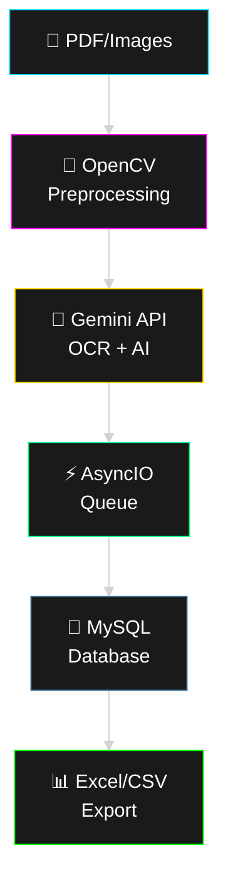

# 🗳️ AI-Powered Voter Data Extraction System

<div align="center">


**🔗 [Live Demo](https://voter.aramanalytics.com/) • Advanced OCR + AI for Electoral Roll Processing**


</div>

---
📦 Need Bulk/Batch Processing?
<table>
<tr>
<td align="center" width="50%">
🚀 Enterprise Features Available
Bulk Processing • Batch Jobs • Custom Integration
API Access • Priority Support • SLA Guaranteed
</td>
<td align="center" width="50%">
📞 Contact 8148983135
Show Image
Show Image
</td>
</tr>
</table>

⚡ Note: Live demo has limited features. Full batch processing code available in this repository.

</div>

## 🎯 Overview

Production-ready **AI-powered OCR system** that extracts structured voter data from electoral rolls with **99% accuracy** and processes at **1500+ requests per minute**.

### ✨ Key Features

```
┌────────────────────────────────────────────────┐
│  🎯 99% Extraction Accuracy                    │
│  ⚡ 1500+ RPM Processing Speed                 │
│  🤖 Gemini AI Integration                      │
│  🔄 AsyncIO Producer-Consumer Architecture     │
│  📊 Excel/CSV Export                           │
│  🎨 Advanced OpenCV Preprocessing              │
│  🔐 Custom Rate Limiter                        │
│  💾 MySQL Database Storage                     │
└────────────────────────────────────────────────┘
```

---

## 🏗️ Architecture



---

## 🚀 Quick Start

### Prerequisites

- Python 3.8+
- MySQL 5.7+
- Gemini API Key

### 📥 Installation

```bash
# 1. Clone the repository
git clone https://github.com/santhoshmdu/voterdataextraction.git
cd voterdataextraction

# 2. Create virtual environment
python -m venv venv
source venv/bin/activate  # On Windows: venv\Scripts\activate

# 3. Install dependencies
pip install -r requirements.txt
```

### 🗄️ Database Setup

```bash
# 1. Login to MySQL
mysql -u root -p

# 2. Create database
CREATE DATABASE voter_db;
USE voter_db;

# 3. Run the SQL schema
source database_schema.sql

# Or manually create table (if schema file available in repo)
```

**Database Schema (voter table):**
```sql
CREATE TABLE voter (
    id INT AUTO_INCREMENT PRIMARY KEY,
    name VARCHAR(255),
    father_name VARCHAR(255),
    house_number VARCHAR(100),
    age INT,
    gender VARCHAR(10),
    voter_id VARCHAR(50) UNIQUE,
    processed_date TIMESTAMP DEFAULT CURRENT_TIMESTAMP,
    INDEX idx_voter_id (voter_id),
    INDEX idx_name (name)
);
```

### ⚙️ Configuration

Create `.env` file in project root:

```env
# Gemini API Configuration
GEMINI_API_KEY=your_gemini_api_key_here

# MySQL Configuration
DB_HOST=localhost
DB_USER=root
DB_PASSWORD=your_mysql_password
DB_NAME=voter_db
DB_PORT=3306

# Flask Configuration
FLASK_SECRET_KEY=your_secret_key_here
FLASK_ENV=development
```

### ▶️ Run Application

```bash
# Start the Flask application
python app.py

# Application will run on http://localhost:5000
```

---

## 📊 Usage

### Web Interface

1. **Navigate to:** `http://localhost:5000`
2. **Upload Files:** PDF or images of electoral rolls
3. **Process:** Click "Extract Data"
4. **Export:** Download results as Excel/CSV

### API Endpoints

```python
# Upload and process voter data
POST /api/extract
Content-Type: multipart/form-data
Body: file=<electoral_roll_pdf>

# Get extraction results
GET /api/results/<job_id>

# Export to Excel
GET /api/export/<job_id>?format=excel

# Export to CSV
GET /api/export/<job_id>?format=csv
```

---

## 🛠️ Tech Stack

<table>
<tr>
<td width="50%">

### Backend
- **Framework:** Flask + AsyncIO
- **AI/ML:** Google Gemini API
- **Computer Vision:** OpenCV, PIL
- **Database:** MySQL 5.7+
- **Data Processing:** Pandas

</td>
<td width="50%">

### Key Libraries
- **opencv-python** - Image preprocessing
- **google-generativeai** - Gemini API
- **flask** - Web framework
- **mysql-connector-python** - Database
- **pandas** - Data export

</td>
</tr>
</table>

---


---

## ⚡ Performance Features

<details>
<summary><b>🔄 AsyncIO Architecture</b></summary>

- Producer-Consumer pattern for parallel processing
- Non-blocking I/O operations
- Handles 1500+ RPM throughput

</details>

<details>
<summary><b>🎨 OpenCV Preprocessing</b></summary>

- Adaptive thresholding
- Noise reduction
- Image enhancement
- Contrast optimization

</details>

<details>
<summary><b>🤖 Gemini AI Integration</b></summary>

- Strict JSON schema validation
- Structured field extraction
- 99% accuracy on formatted data
- Automatic retry on failures

</details>

<details>
<summary><b>🔐 Rate Limiting</b></summary>

- Custom limiter handling 1500+ RPM
- Prevents API throttling
- Queue management
- Automatic retry logic

</details>

---

## 🔧 Configuration Options

### Rate Limiter Settings

```python
# In app.py or config file
RATE_LIMIT_RPM = 1500
BATCH_SIZE = 50
RETRY_ATTEMPTS = 3
TIMEOUT_SECONDS = 30
```

### OpenCV Parameters

```python
# Image preprocessing configuration
ADAPTIVE_THRESHOLD_BLOCK = 11
GAUSSIAN_BLUR_KERNEL = (5, 5)
MORPH_KERNEL_SIZE = (3, 3)
```

---

## 📊 Sample Output

**Excel/CSV Format:**
```
| Name          | Father's Name | House No | Age | Gender | Voter ID   |
|---------------|---------------|----------|-----|--------|------------|
| John Doe      | James Doe     | 123/A    | 35  | Male   | ABC1234567 |
| Jane Smith    | Robert Smith  | 456/B    | 28  | Female | XYZ9876543 |
```

---

## 🐛 Troubleshooting

<details>
<summary><b>MySQL Connection Error</b></summary>

```bash
# Check MySQL service
sudo systemctl status mysql

# Verify credentials in .env file
# Ensure database 'voter_db' exists
```

</details>

<details>
<summary><b>Gemini API Issues</b></summary>

```bash
# Verify API key is set correctly
# Check API quota limits
# Ensure network connectivity
```

</details>

<details>
<summary><b>OpenCV Import Error</b></summary>

```bash
# Reinstall opencv-python
pip uninstall opencv-python opencv-python-headless
pip install opencv-python
```

</details>

---

## 📈 Performance Metrics

| Metric | Value |
|--------|-------|
| **Accuracy** | 99.0% |
| **Processing Speed** | 1500+ RPM |
| **Average Response Time** | <2s per document |
| **Supported Formats** | PDF, JPG, PNG |
| **Concurrent Requests** | 50+ |

---

## 🔐 Security Notes

- ⚠️ Never commit `.env` file
- 🔒 Use strong MySQL passwords
- 🔑 Rotate API keys regularly
- 🛡️ Enable HTTPS in production
- 📝 Sanitize all user inputs

---

## 🌐 Deployment

### Production Checklist

```bash
# 1. Set production environment
export FLASK_ENV=production

# 2. Use production WSGI server
pip install gunicorn
gunicorn -w 4 -b 0.0.0.0:5000 app:app

# 3. Setup Nginx reverse proxy
# 4. Enable SSL/TLS
# 5. Configure firewall rules
# 6. Setup database backups
```

---

## 🤝 Contributing

Contributions are welcome! Please:

1. Fork the repository
2. Create feature branch (`git checkout -b feature/AmazingFeature`)
3. Commit changes (`git commit -m 'Add AmazingFeature'`)
4. Push to branch (`git push origin feature/AmazingFeature`)
5. Open Pull Request

---

## 📄 License

MIT License - See [LICENSE](LICENSE) file for details

---

## 👨‍💻 Author

**Santhosh Thiruvengadam**

[](https://github.com/santhoshmdu)
[](https://linkedin.com/in/santhoshmadurai)
[](mailto:sahash1903@gmail.com)
[](https://voter.aramanalytics.com/)

---

## 🙏 Acknowledgments

- Google Gemini API for AI capabilities
- OpenCV community for image processing
- Flask framework for web backend

---

<div align="center">

**⭐ Star this repo if you find it useful!**

<sub>Built with ❤️ for efficient electoral data management</sub>

</div>
